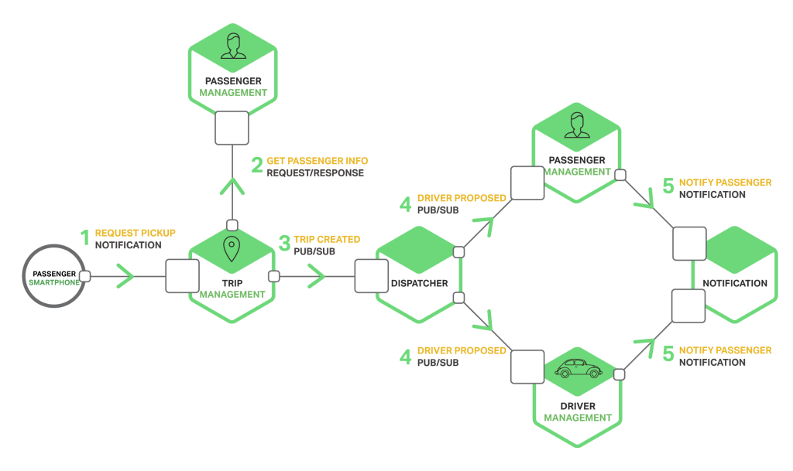

# Hystrix


## Prélude

---

## Qui suis-je ?


* Thomas LE ROUX
* Backend & Infrastructure Engineer chez Captain Dash
* @VenomberVeelen

---

## Résilience

* Désigne la capacité pour un corps, un organisme, une organisation ou un système quelconque à **retrouver ses propriétés initiales** après une altération.

* Capacité d'un écosystème, d'une espèce ou d'un individu à **récupérer facilement** un fonctionnement normal après avoir subi une perturbation.

* Capacité d'un système **à fournir et à maintenir** un service minimum en cas d'attaques, d'incidents, de pannes ou de manques de ressources.

---

### Pourquoi Hystrix ?

---

### Micro Services



---


#### Qu'est ce qui peut mal se passer ?
_Loi de Murphy, vous connaissez ?_

---

### Rien, parce que...

* Le réseau est fiable.
* Il n'y aurra pas de latence.
* La bande passante est largement suffissante.
* Il n'y aurra pas de panne.
* L'application n'a aucune exception.

---


---

### Quelques chiffres

* **30** services
* **99.99%** uptime par service
* **99.7%** uptime sur l'infrastructure _(99.99<sup>30</sup>)_
* **1 milliards** de requêtes
* **32 requêtes** par seconde
* **3 millions** d'erreurs
* **2+ heures** de pannes par mois

---


### En théorie, la réalité est pire...

---

### Ses principes

* Contrôle des latences et des pannes des dépendances ou sources externes.
* Stopper les cascades de défaillance dans les systèmes distribués.
* Échoue vite, en silence, mais récupère rapidement.
* Dégradation en finesse et solution alternative.
* Supervision et monitoring en temps _-presque-_ réel.

---

### Ses concepts

* Timeout
* Circuit Breaker
* Load shedder
* Fail fast
* Isolation
* Escalation
* Failover
* Fallback
* Retry
* Recover

Note: Jauge + Disjoncteur

---

# Atelier pratique


_Assez de théorie, montre moi ton code!_

---

### Hello World

```java
public class HelloWorldCommand extends HystrixCommand<String> {

    private final String name;

    public CommandHelloWorld(String name) {
        super(HystrixCommandGroupKey.Factory.asKey("ExampleGroup"));
        this.name = name;
    }

    @Override
    protected String run() {
        // a real example would do work like a network call here
        return "Hello " + name + "!";
    }
}
```

---

### Éxecution synchrone

```java
String s = new HelloWorldCommand("World").execute();
```

---

### Éxecution asynchrone

```java
Future<String> fs = new HelloWorldCommand("World").queue();

String s = fs.get();
```

---

### Éxecution avec ReactiveX

```java
Observable<String> ho = new HelloWorldCommand("World").observe()
ho.subscribe(new Observer<String>() {

    @Override
    public void onCompleted() {
        // nothing needed here
    }

    @Override
    public void onError(Throwable e) {
        e.printStackTrace();
    }

    @Override
    public void onNext(String v) {
        System.out.println("onNext: " + v);
    }

});
```

**Avec Java 8:**

```java
ho.subscribe((v) -> {
    System.out.println("onNext: " + v);
})
```

---

### Fallback

```java
public class HelloFailureCommand extends HystrixCommand<String> {

    private final String name;

    public CommandHelloFailure(String name) {
        super(HystrixCommandGroupKey.Factory.asKey("ExampleGroup"));
        this.name = name;
    }

    @Override
    protected String run() {
        throw new RuntimeException("this command always fails");
    }

    @Override
    protected String getFallback() {
        return "Hello Failure " + name + "!";
    }
}
```

---

### Comment ça marche ?


---

### Quelques exemples


---

### Échec avec alternative


---

### En silence

```java
public class ListUserCommand extends HystrixCommand<List<User>> {

    private final long pagination;

    public ListUserCommand(long pagination) {
        super(HystrixCommandGroupKey.Factory.asKey("Users"));
        this.pagination = pagination;
    }

    @Override
    protected List<User> run() {
        return DB.users.list(pagination);
    }

    @Override
    protected List<User> getFallback() {
        return new ArrayList<User>(0);
    }
}
```

---

### Par défaut

```java
public class UserHasAgeRestrictionCommand extends HystrixCommand<Boolean> {

    private final String email;

    public UserHasAgeRestrictionCommand(String email) {
        super(HystrixCommandGroupKey.Factory.asKey("Users"));
        this.email = email;
    }

    @Override
    protected Boolean run() {
        return DB.users.hasAgeRestriction(email);
    }

    @Override
    protected Boolean getFallback() {
        return false;
    }
}
```

---

### Chaîner les commandes


---

### Service de secours

```java
public class GetValueCommand extends HystrixCommand<String> {

    private final int id;

    public GetValueCommand(int id) {
        super(Setter
            .withGroupKey(HystrixCommandGroupKey.Factory.asKey("RemoteService"))
            .andCommandKey(HystrixCommandKey.Factory.asKey("GetValueCommand"))
        );
        this.id = id;
    }

}
```

---

```java
@Override
protected String run() {
    return RemoteServiceClient.getValue(id);
}

@Override
protected String getFallback() {
    return new GetValueFallbackCommand(id).execute();
}
```

---

### Service de secours

```java
class GetValueFallbackCommand extends HystrixCommand<String> {

    private final int id;

    public GetValueFallbackCommand(int id) {
        super(Setter
            .withGroupKey(
                HystrixCommandGroupKey.Factory.asKey("RemoteService")
            )
            .andCommandKey(
                HystrixCommandKey.Factory.asKey("GetValueFallbackCommand")
            )
            .andThreadPoolKey(
                HystrixThreadPoolKey.Factory.asKey("RemoteServiceFallback")
            )
        );
        this.id = id;
    }

}
```

---

### Service de secours

```java
@Override
protected String run() {
    MemCacheClient.getValue(id);
}

@Override
protected String getFallback() {
    // the fallback also failed
    // so this fallback-of-a-fallback will
    // fail silently and return null
    return null;
}
```

---

### Cache en local

```java
class GetValueCommand extends HystrixCommand<String> {

    private final CacheApi cache;
    private final int id;

    public GetValueCommand(CacheApi cache, int id) {
        super(Setter
            .withGroupKey(HystrixCommandGroupKey.Factory.asKey("RemoteService"))
            .andCommandKey(HystrixCommandKey.Factory.asKey("GetValueCommand"))
        );
        this.cache = cache;
        this.id = id;
    }

}
```

---

### Cache en local

```java
@Override
protected String run() {
    Sring s = RemoteServiceClient.getValue(id);
    cache.set(id, s)
    return s
}

@Override
protected String getFallback() {
    return cache.get(id);
}
```

---

### Timeout

```java
public class LatentResource {

    private final long latency;

    public LatentResource(long latency) {
        this.latency = ((latency < 0L) ? 0L: latency);
    }

    public Strig getPayload() {
        try {
            Thread.sleep(latency)
        } catch (InterruptedException e) {
            // Ignore
        }
        return "Some payload";
    }
}
```

---

### Timeout

```java
public class TimeoutCommand extends HystrixCommand<String> {

    private final LatentResource resource;

    public TimeoutCommand(int timeout, LatentResource resource) {
        super(Setter
            .withGroupKey(HystrixCommandGroupKey.Factory.asKey("default"))
            .addCommandPropertiesDefaults(HystrixCommandProperties.Setter()
                .withExecutionIsolationThreadTimeoutInMilliseconds(timeout)
            )
        );
        this.resource = resource;
    }

}
```

---

### Timeout

```java
@Override
protected String run() throws Exception {
    return resource.getData();
}

@Override
protected String getFallback() {
    return "Resource timed out";
}
```

---

### Pour aller plus loin

* Request Caching
* Request Collapsing
* Plugins
  * Event Notifier
  * Metrics Publisher
  * Concurrency Strategy
* Dashboard

---


### Demo avec Robin

---


### Conclusion
